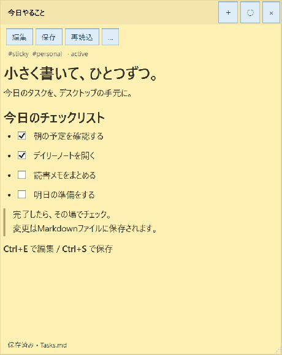
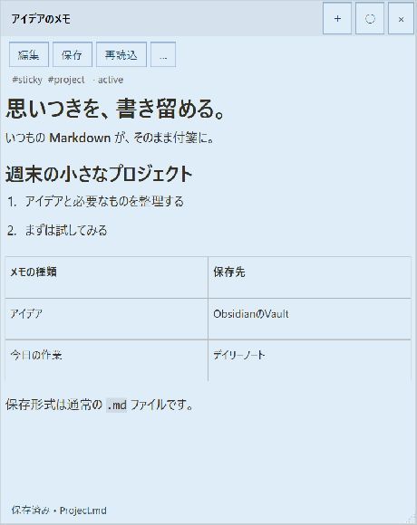
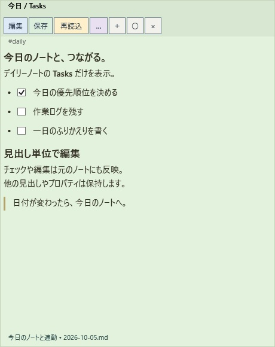

[English](README.md) | [日本語](README.ja.md) | [简体中文](README.zh-CN.md)

# Markdown Sticky Notes — ObsidianとGoogle CalendarをWindowsの付箋で


**ObsidianのノートとGoogle Calendar（Googleカレンダー）の予定をデスクトップで一緒に扱える**、Windows向けMarkdown付箋アプリです。デイリーノートのタスクと予定を別々の付箋で並べたり、同じ付箋にメモと予定を表示したりできます。

Obsidian Vaultの元のMarkdownを編集し、タスクをチェックしながら予定を確認できます。Google Calendarの件名・説明は確認後に更新できます。Google Calendar連携は任意で、利用者自身のOAuth設定が必要です。Markdown付箋だけならObsidianがなくても使えます。

## ObsidianのノートとGoogle Calendarを併用する

| 使い方 | 操作と動作 |
| --- | --- |
| タスクと予定を並べて確認 | 今日のデイリーノートのTasks見出しを付箋にし、別の付箋でCalendarの予定を検索 |
| 会議メモと予定の詳細を同じ付箋に表示 | 表示対象のMarkdown本文に `@calendar` コマンドを書くと、一致した予定が本文の下に表示 |
| 元のデータへ変更を反映 | タスクのチェックと本文編集は元の `.md` に保存。予定の件名・説明の編集は確認後にGoogle Calendarへ送信 |

例えば、[Google Calendarの初回認証](#初回認証)を済ませてから、次の内容をノートに保存します。日時・タイムゾーン・検索語は使いたいものに置き換えてください。

```markdown
## 会議の準備
- [ ] Obsidianで議題を確認する
- [ ] 質問を書き出す

@calendar 2026-10-05T09:00+09:00 会議
```

このコマンドは指定日時を起点に検索し、自動で「今日」を指定するものではありません。予定は約60秒ごと、または手動で再取得します。見出しの一部分だけを表示する場合は、その範囲内にコマンドを置いてください。**Markdownのタスクとカレンダーの予定は別のデータです。** タスクからの予定作成、予定のMarkdownへの転記、両者の自動同期は行いません。予定の日時や参加者の変更には対応していません。

[Windows版のダウンロード](#ダウンロードとインストール) · [Obsidianのデイリーノートを表示](#デイリーノートの特定箇所を常に表示編集) · [Google Calendarの設定](#初回認証)

## スクリーンショット

バージョン0.0.2のWPFコントロールで、紹介用サンプルを描画した付箋画面です。画像をクリックすると元のサイズで表示できます。

| 手元にチェックリスト | Markdownでメモ | デイリーノートと連動 |
| :---: | :---: | :---: |
| [](docs/images/sticky-tasks-ja.jpg) | [](docs/images/sticky-markdown-ja.jpg) | [](docs/images/sticky-daily-ja.jpg) |

撮影用の架空データを使用しています。[サンプルファイルと撮影手順](docs/SCREENSHOTS.md)も同梱しています。

## 主な機能

| 機能 | できること |
| --- | --- |
| デスクトップ付箋 | 複数の付箋、移動・サイズ変更、最前面表示、配置の復元 |
| Markdownの表示・編集 | 見出し、リスト、チェックボックス、表、コードなどを表示し、ソースを編集 |
| Obsidian連携 | Vault内の `.md` を直接読み書き。タイトル・タグ・状態・色をYAMLプロパティで管理 |
| 見出しへの連動 | 既存ノートの指定見出しだけを表示・編集し、他の箇所を保持 |
| デイリーノート | 日時タグ付き正規表現で今日のノートへ切り替え、タスクを付箋上でチェック |
| Google Calendar（任意） | 予定の検索・表示、確認後の件名・説明の編集 |
| データ保護 | 外部変更の検出、競合時の上書き防止、書込み前のバックアップ |

アプリの画面・メニューは現在日本語です。ドキュメントは英語・日本語・簡体字中国語で提供しています。

## ダウンロードとインストール

必要な環境は **Windows 10 / 11（x64）** です。管理者権限、.NETの追加インストール、ObsidianのCLIやプラグインは不要です。

1. [GitHub Releases](https://github.com/AvocadoWasabi/StickyNotes/releases) を開きます。
2. `StickyNotes-win-x64.zip` をダウンロードします。`Source code` は開発者向けです。
3. ZIPを右クリックし、「すべて展開」を選びます。
4. 展開先の `Install.cmd` をダブルクリックします。
5. スタートメニューの「Markdown Sticky Notes」から起動します。

アプリは `%LOCALAPPDATA%\Programs\MarkdownStickyNotes` に配置されます。自動起動は登録しません。[v0.0.2のダウンロード](https://github.com/AvocadoWasabi/StickyNotes/releases/tag/v0.0.2)はこちらです。

インストールせずに使う場合は、展開先の `StickyNotes.exe` を実行します。どちらの場合もEXE以外の同梱ファイルが必要です。未署名のためWindowsが確認を表示する場合は、配布元とファイルを確認してから実行してください。

### 初回設定

通知領域のアイコンを右クリックして「設定」を開き、付箋の保存先を指定します。Obsidianと連携する場合はVault内のフォルダを選んでください。デイリーノートを使う場合は、そのフォルダと日時タグ付き正規表現も設定します。Google Calendarを使わなければ認証設定は不要です。

### 更新・アンインストール

更新時は通知領域の「終了」でアプリを終了し、新しいZIPを別フォルダへ展開して `Install.cmd` を実行します。ノートと設定は保持されます。

**0.0.1からの更新:** デイリーノートの指定は日時タグ付き正規表現に統一しました。ドキュメントに記載した日付書式は自動変換しますが、設定の一致ファイル名を確認し、独自の書式は手動で修正してください。付箋の保存先とデイリーノートのフォルダは独立して保存するよう修正したため、以前に値が混ざった場合は両方を確認してください。フォーカスが外れた際の確認なし自動保存は任意設定で、初期状態はオフです。変更全体は [0.0.2の変更履歴](CHANGELOG.ja.md) を参照してください。

削除時はアプリを終了して `%LOCALAPPDATA%\Programs\MarkdownStickyNotes` とスタートメニューのショートカットを削除します。設定・バックアップとMarkdownファイルは残ります。詳しくは [インストール・更新・削除](docs/INSTALL.md) を参照してください。

## 関連資料

- [バージョン履歴](CHANGELOG.ja.md)
- [インストール・更新・削除](docs/INSTALL.md)
- [開発・ブランチ運用・リリース](docs/DEVELOPMENT.md)
- [サードパーティライセンス](THIRD-PARTY-NOTICES.txt)
- [Obsidian Basesのサンプル](examples/StickyNotes.base) / [デイリーノートのサンプル](examples/Daily.md)

## 起動

インストールした場合はスタートメニュー、ZIP版は展開先の `StickyNotes.exe` から起動します。ソースからビルドした場合の実行ファイルは `artifacts/app/StickyNotes.exe` です。

付箋の上部をドラッグして移動、端・右下をドラッグしてサイズ変更できます。`○ / ●` は最前面表示の切替です。タイトルバーのない付箋型ウィンドウで、タスクバーには表示せず、通知領域に常駐します。

編集・保存・再読込・「…」・新規・最前面・閉じるのボタンは、タイトル下の同じ列に並びます。編集は青、保存は緑、再読込は黄、その他は紫の背景です。

- `＋`: 新しい付箋
- `編集` / `Ctrl+E`: Markdownソースの編集
- `保存` / `Ctrl+S`: ファイルに保存して表示モードへ
- `再読込`: 元ファイルを読み直す。未保存の編集がある場合は確認
- `…`: プロパティ・予定取得・既存ファイルを開く・見出し連動・設定・終了
- `×`: その付箋だけを閉じる。mdファイルは削除しません
- アプリ全体の終了: `… → アプリを終了`、または通知領域アイコンの `終了`

`… → 表示スケール` で、付箋内の表示を **50～200%** に変更できます（既定は100%）。倍率を選ぶか、拡大・縮小で10ポイントずつ調整します。閲覧中は本文エリアで `Ctrl＋マウスホイール`、または `Ctrl＋＋` / `Ctrl＋－` でも調整でき、`Ctrl＋0` で100%に戻します。見出し・本文・表・コード・チェックボックスの比率を保ち、Calendarの予定とデイリーノートの案内も同じ倍率で表示します。操作ボタン・タイトル・タグ・ステータス・Markdown編集欄のサイズは変えません。倍率は付箋ごとに保存し、再読込・再起動後も復元します。元のMarkdownや未保存の入力は変更しません。

開いている付箋の配置・サイズ・最前面設定は移動時と終了時に記録し、次回起動時に復元します。複数モニター、負の画面座標、PerMonitorV2 DPIに対応し、接続を外したモニター上の付箋は利用可能な画面内に戻します。未保存の編集がある場合は終了時に確認します。

本文や本文エリアの余白をクリックすると、Markdown入力欄に切り替わって編集できます。「編集」または `Ctrl+E` も使えます。チェックボックス・リンク・スクロールバーのクリックはそれぞれの操作を行い、編集に切り替えません。「保存」または `Ctrl+S` で保存し、閲覧表示に戻ります。「編集」の再クリックでも入力は保持します。

編集欄から別の操作や別アプリへフォーカスが移ると、変更がある場合に保存を確認します。「はい」は保存、「いいえ」は変更を破棄して再読込、「キャンセル」は入力を保持して編集を続けます。変更がなければ確認しません。設定の「編集欄からフォーカスが外れたら、確認せず自動保存する」をオンにして保存すると、確認なしで保存します（初期設定はオフ）。自動保存でもバックアップ・外部変更検出を行い、失敗した場合はエラーと入力を保持します。入力欄の右クリックメニュー操作では保存確認しません。付箋を閉じる／アプリを終了する際の未保存確認は従来どおりです。

## 保存先とObsidian

初期保存先は `Documents/StickyNotesData` です。`… → 設定` でObsidian Vault内のフォルダ（例: `Vault/Sticky Notes`）を選んでください。保存先を変更して設定を保存すると、既存ファイルも移行するか確認します。**はい**で旧フォルダ内のすべての `.md` をサブフォルダ・閉じている付箋も含めて移行、**いいえ**で新規付箋の保存先だけ変更、**キャンセル**で設定保存を中止します。開いている付箋の配置と未保存の編集は維持します。付箋の保存フォルダとデイリーノートのフォルダは独立した設定で、付箋の保存先変更・移行によってデイリーノートのフォルダ設定を自動で書き換えません。旧フォルダ内にデイリーノートのMarkdownがあればファイル移行の対象に含まれるため、その移動先を参照したい場合はデイリーノートのフォルダ設定を明示的に変更してください。旧フォルダ外のファイルとMarkdown以外のファイルは移動しません。

移行先の既存ファイルは上書きしません。同名ファイルがあれば移動前に中止し、移動・設定保存の失敗時は元に戻します。復元できなかったファイルがあれば、手動復旧用にその場所をエラーに表示します。互いに親子関係にあるフォルダ間、リンク・ジャンクションを含むパスの移行には対応しません。移動しなかったファイルへの相対リンクは修正が必要な場合があります。大量の移行前にはバックアップを取り、強制終了・電源断などで中断した場合は再試行前に両方のフォルダを確認してください。

付箋はUTF-8の通常の `.md` です。例えば次のプロパティを持ちます。

```yaml
---
type: sticky
id: 付箋ごとのID
title: 買い物
tags:
  - sticky
  - personal/shopping
status: active
color: yellow
created: 2026-10-05T09:00:00+09:00
updated: 2026-10-05T09:00:00+09:00
---
```

タグ・タイトル・状態・色は `… → タグ・タイトル・状態・色` で変更できます。色は `yellow / green / blue / pink / gray`。簡単な整理用に `status` を追加しており、`active / done / archived` など自由な値が使えます。状態は分類用で、自動削除・非表示はしません。

`examples/StickyNotes.base` をVaultにコピーすると `type: sticky` のノート一覧を作成できます。通常ノートだけのBaseには `type != "sticky"` を条件に追加するか、フォルダ除外 `!file.inFolder("Sticky Notes")` を使えます。

アプリ専用の配置情報や認証データはVaultに混ぜず、`%LOCALAPPDATA%/StickyNotes` に保存します。外部で変更されたファイルは約2秒間隔で読み直します。付箋側で編集中の場合は自動で置き換えず、競合を表示します。

参考: [Obsidian Properties](https://obsidian.md/help/properties)、[Bases syntax](https://obsidian.md/help/bases/syntax)

## デイリーノートの特定箇所を常に表示・編集

**対応しています。Obsidian CLIやプラグインは不要です。** 元のmdファイルを直接読み書きします。

1. 設定でデイリーノートのフォルダと日時タグ付き正規表現を指定し、一致するファイル名を確認して「保存して閉じる」を押します。
2. `… → デイリーノートを表示…` を選びます。設定から今日のファイルを読み込みます。絶対パスの入力や毎日切替の指定は不要です。
3. 共通の「表示する見出し名」欄で既存見出しを選ぶか、新しい名前を `#` なしで入力します。空欄なら本文を全表示します。
4. 「表示」を押すと付箋に表示します。新しい名前の場合は、元ファイルをバックアップして末尾に `## 見出し名` を追加します。入力やキャンセルだけでは書き込みません。チェックボックスを押すと元ファイルの対応行だけを更新します。

デイリーノートの形式は **日時タグ + 正規表現** に統一しています。日付書式モードや切替チェックはありません。タグは名前付きグループ `year`・`month`・`day` です。`2026-10-05(月).md` などの場合は、ノートが入っているフォルダを選び、次を指定します。

```regex
(?<year>\d{4})-(?<month>\d{2})-(?<day>\d{2})(?:\([^)]+\))?\.md
```

空欄・空白のみの場合はこの既定例を自動補完します。「日時タグ付きの既定例を挿入」ボタンでは、入力欄全体を置き換える前に確認し、「いいえ」なら既存の式を維持します。設定を開くだけでは確認を出しません。変更はファイル名の照合に反映し、保存操作で設定に記録します。

各タグは必須で、それぞれ年・月・日の数値を1回ずつ取り出します。日付がローカル時刻の対象日（通常は今日、保持設定では昨日）と一致するファイルだけを選びます。照合は大文字・小文字を区別せず、**`.md` を含む相対パス全体**が対象で、拡張子は自動付加しません。サブフォルダの区切りは `/` を使い、親フォルダを選ぶ場合は式の先頭に `Diary/` などを付けます。この例では別の日付や `WeeklyTasksLog-…` などの別名ファイルは選ばれません。

既存の正規表現はそのまま引き継ぎます。旧設定の `yyyy-MM-dd`、`yyyy/MM/yyyy-MM-dd` と、それぞれに `(ddd)`・`(dddd)` を付けた形式は、設定読込時に日時タグ付き正規表現へ変換します。それ以外の独自日付書式は元の文字列を保持しますが、日付書式として実行しないため、設定画面で正規表現に修正してください。この変換によるファイルやフォルダの移動はありません。

サブフォルダも検索しますが、シンボリックリンク・ジャンクションは除外し、指定フォルダまでのパスにこれらがある場合も使用できません。今日が一致しない場合は後述の待機・保持設定に従い、複数一致はエラーにします。ファイルの新規作成や任意の1件の選択はしません。検索エラー時も未保存の編集は保持します。不正な式は設定保存時に拒否します。式は4096文字・1回の照合は100ミリ秒まで、検索は各項目間で10000項目・1秒の上限を確認します。ファイルシステムへのアクセス自体には、それ以上かかる場合があります。検索を小さく保つため、デイリーノートのフォルダを直接指定してください。

設定画面では、入力を止めて約300ミリ秒後に未保存のフォルダ・正規表現で照合し、今日の一致ファイル名またはエラーを表示します。フォルダの変更でも更新し、検索はバックグラウンドで行って古い入力の結果は表示しません。

本文プレビューは「デイリーノートを付箋にする」「ノートの一部分を付箋にする」画面の末尾に表示します。ファイル読込・再読込・見出しの選択や入力に合わせ、付箋に表示する範囲のMarkdownを先頭4000文字まで読み取り専用で表示します。空欄なら本文全体、新しい見出しなら末尾への追加予定を示します。プレビューだけでは元ノートに書き込みません。

固定ノートは別メニューの `… → ノートの一部分を付箋にする…` を使います。「フォルダを選択…」からフォルダとMarkdownファイルを順に選ぶか、「Markdownファイルを選択…」で直接選びます。絶対パスの手入力やデイリーノートへの切替項目はありません。デイリーノートと同じ見出し選択欄で、既存見出し・新規見出し・空欄での全表示を指定できます。両メニューは通知領域にもあります。「再読込」で見出し一覧を更新できます。

表示前に元ファイルが外部変更されていた場合は、上書きせず再読込を求めます。デイリーノートの対象ファイルが日付切替などで変わった場合も同様です。新規見出しの追加時は元の内容・改行・UTF-8 BOMを保持します。閉じていないコードフェンスや同名見出しなどで対象を一意に扱えない場合は追加を拒否します。

表示範囲は対象見出しの直後から、同じまたは上位レベルの次の見出しの直前までです。小見出しも含みます。元ノートの他の箇所・YAMLは保持します。同名見出しが複数ある場合は安全のため編集を拒否します。コードフェンス内の見出しは無視します。対象見出しには `#` 形式（ATX）を使用してください。

日付が変わると今日のファイルに切り替えます。今日の分が未作成なら、既存のデイリー付箋の本文エリアに「Obsidianで今日の分を作成すると自動表示される」旨と、昨日の分を保持できる設定の案内を表示します。約2秒ごとに確認し、作成を検出すると表示します。

設定の「今日のデイリーノートが未作成のとき」で選択できます。

- **待機メッセージを表示（既定）**: 今日の分がなければ案内を表示します。
- **1. 今日の分が作成されるまで昨日の分を表示**: 昨日を表示し、今日の作成を検出すると自動で切り替えます。
- **2. 再読込するまで昨日の分を表示**: 今日が未作成のときに昨日を表示した付箋では、今日が作成されても「再読込」まで昨日を保持します。

昨日の分もなければ待機表示になり、一昨日以前には遡りません。「再読込」はどちらの保持設定でも今日を確認し、未作成ならその日は昨日へ戻らず待機します。保持の状態は付箋を開いている間だけ有効で、再起動時に今日の分があれば今日を表示します。設定の選択自体は保存されます。昨日を表示中は日付と案内を付箋内に表示し、編集・タスクのチェックはその日の元ファイルに保存します。編集中は自動切替せず、未保存の入力を保持します。フォルダ・正規表現のエラー、複数一致、見出しの欠落はエラー表示になります。新しいファイルは自動作成せず、見出しの追加は選択画面で新しい名前を入力して「表示」を押した場合だけ行います。初めてデイリー付箋を追加する際は今日のファイルが必要です。

## Google Calendar

付箋本文の独立した行に次の形式で入力し、保存します。

```text
@calendar 2026-10-05T09:00+09:00 会議
```

検索語は省略できます。時差省略時はWindowsのローカル時刻です。指定時刻以降の予定を開始時刻順に最大100件取得し、付箋内に表示します。Googleの `timeMin` は予定の終了時刻に対する下限のため、指定時刻に進行中の予定も含みます。繰り返し予定は各回に展開します。約60秒間隔、または `… → 予定を今すぐ取得` で再取得します。1枚の付箋につき最初のコマンドが対象です。前後は空行で区切ってください。コードフェンス内のコマンド例は実行しません。

予定をクリックすると件名・説明を編集できます。その後、変更前後と参加者への通知を示す確認ダイアログで **OKした場合のみ** GoogleへPATCHします。日時・参加者・繰り返し規則は変更しません。繰り返し予定の編集は取得した回が対象です。取得後にGoogle側で変更があった場合はETagで競合を検出し、上書きせず再取得を促します。

### 初回認証

1. [Google Cloud Console](https://console.cloud.google.com/) でプロジェクトを選び、Google Calendar APIを有効にします。
2. OAuth同意画面を設定します。テスト公開中なら利用するGoogleアカウントをテストユーザーに追加します。
3. 種類 **デスクトップアプリ** のOAuthクライアントを作成し、JSONをダウンロードします。
4. アプリの設定画面でそのJSONを選択します。Calendar IDは通常 `primary` です。
5. `設定を保存してGoogleにログイン` からブラウザで認証します。

認証はシステムブラウザ + loopback + PKCEを使用します。トークンはWindows DPAPIのCurrentUserで暗号化し、`google-token.bin` に保存します。Google OAuth JSONはリポジトリやVaultの共有先に入れないでください。

実際のGoogleアカウントでの接続・更新確認はユーザーのOAuth設定後に必要です。自動テストでは模擬HTTPによる検索・PATCH・ETag競合を確認しています。

参考: [Google Desktop OAuth](https://developers.google.com/identity/protocols/oauth2/native-app)、[Calendar resource versions](https://developers.google.com/calendar/api/guides/version-resources)

## Markdown対応範囲・データ保護

- 見出し、太字、斜体、取り消し線、通常・番号付きリスト、チェックリスト、引用、コード、表、リンクを描画します。
- HTMLは実行せず文字列として表示します。画像は現状では代替テキスト表示です。
- Obsidianの `[[wikilink]]`、埋め込み、Dataview、数式、コールアウト専用装飾は未対応です。文字として保持します。
- 入力はUTF-8（BOM有無を保持）。本文編集時は既存の改行形式に合わせます。
- プロパティ編集時はYAMLを再シリアライズするため、コメントや書式は変化する場合があります。未知のプロパティ値と本文は維持します。
- 書込み前にファイル全体のハッシュを照合します。編集中に外部変更があれば上書きせず、編集内容をコピー・退避してから再読込できます。
- 書込み前の内容を `%LOCALAPPDATA%/StickyNotes/backups` に保存します。日付・GUID付きファイルから手動復旧できます。バックアップは自動削除しません。
- ファイルの書込みは排他ハンドルで行い、書込み例外時は復元を試みます。電源断などに備えて、Vault全体の通常のバックアップも利用してください。

## 開発・検証

必要環境: Windows / .NET 8 SDK。

```powershell
.\build.ps1
.\build.ps1 -Publish
```

作業フォルダ内に `.tools/dotnet` がある場合はそのSDKを優先します。テストは外部サービスや実際のVaultに接続せず一時ファイルと模擬APIを使います。

通常のビルドでも、自己完結型アプリ、インストール用スクリプト、関連資料、ライセンス、英語・日本語・簡体字中国語のREADMEと変更履歴を `artifacts/app` に生成します。完了後、起動中のSticky Notesを通知領域から終了し、`artifacts/app/Install.cmd` を実行すればすぐローカルインストールできます。ビルド完了時にこのパスを案内し、インストール自体は自動実行しません。

`-Publish` は追加で `artifacts/StickyNotes-win-x64.zip` とSHA256チェックサムを生成・更新します。通常のビルドでは既存ZIPを更新しません。3言語の同梱は現在のソースからのビルドに適用し、公開済みのZIPは当時の資料を保持します。

検証用の保存先を分離して起動する場合（このモードでは画面テスト用にタスクバーにも表示します）:

```powershell
.\artifacts\app\StickyNotes.exe --data-dir C:\Temp\StickyNotes-test
```

構成: `StickyNotes.Core`（Markdown保存・見出し編集・Calendar REST/OAuth）、`StickyNotes`（WPF付箋・描画・通知領域・モニター配置）、`StickyNotes.Tests`（データ保護・描画・APIの実行可能テスト）。

変更は専用ブランチで実装し、完了前に検証・コードレビュー・セキュリティレビューを行ってローカルでコミットします。重大な未解決指摘があればマージ・pushを中止します。通常の手順ではPRを作成しません。mainへのマージ、作業ブランチを含むGitHubへのpush、Releaseの公開は、リポジトリ所有者の明示的な指示を受けた場合に行います。英語・日本語・簡体字中国語のドキュメントを同期して更新します。詳細は [開発ガイド](docs/DEVELOPMENT.md) を参照してください。
