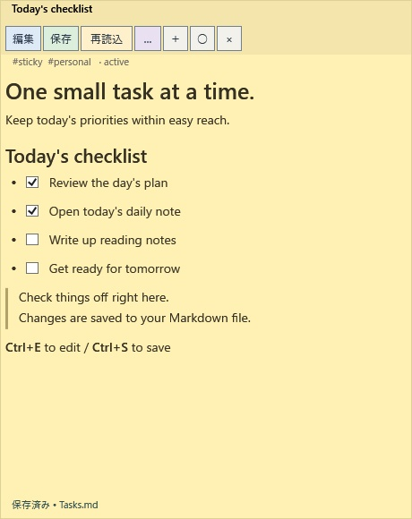
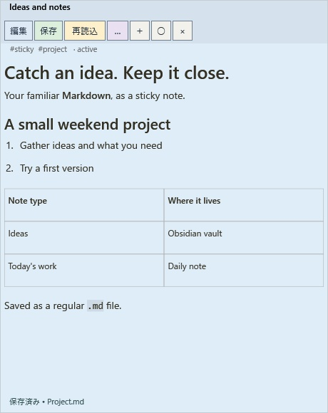
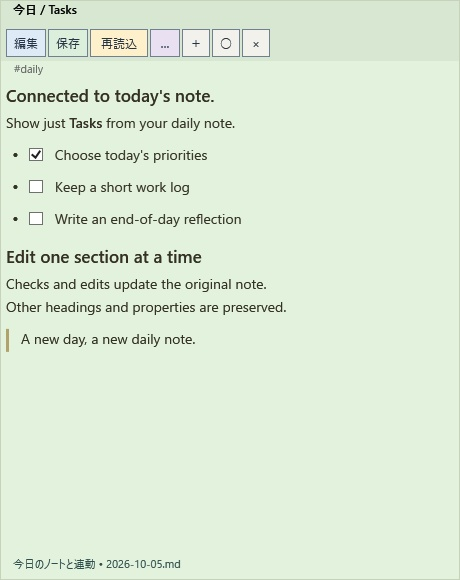

[English](README.md) | [日本語](README.ja.md) | [简体中文](README.zh-CN.md)

# Markdown Sticky Notes — 在 Windows 桌面便签中使用 Obsidian 和 Google Calendar


这是一款 Windows Markdown 桌面便签应用，可将 **Obsidian 笔记与 Google Calendar（Google 日历）的日程放在桌面上一起使用**。你可以在不同便签中并排查看每日笔记中的任务和日程，也可以在同一张便签中显示笔记与日程。

直接编辑 Obsidian 仓库中的原始 Markdown 文件、勾选任务并查看日程。确认后，还可以更新日程的标题和说明。Google Calendar 是可选功能，需要自行配置 OAuth；仅使用 Markdown 便签时，无需安装 Obsidian。

## 同时使用 Obsidian 笔记和 Google Calendar

| 使用场景 | 操作与行为 |
| --- | --- |
| 并排查看任务与日程 | 将今日每日笔记的 Tasks 标题部分显示为便签，再打开另一张便签查询 Calendar 日程 |
| 在同一张便签中查看会议笔记和日程详情 | 在便签显示的 Markdown 正文中添加 `@calendar` 命令，匹配的日程会显示在正文下方 |
| 将修改写回原始数据 | 勾选任务和编辑正文会保存到原始 `.md` 文件；日程标题和说明的修改经确认后发送到 Google Calendar |

例如，完成 [Google Calendar 初次授权](#初次授权)后，将以下内容保存到笔记。请按需要替换示例中的日期、时间、时区和搜索词：

```markdown
## 会议准备
- [ ] 在 Obsidian 中查看议程
- [ ] 写下问题

@calendar 2026-10-05T09:00+09:00 会议
```

命令以指定时间为起点查询，并不自动代表“今天”。日程约每 60 秒刷新一次，也可手动刷新。若只显示某个标题部分，请将命令写在该部分内。**Markdown 任务与日历日程是独立的数据：**应用不会把任务转换成日程、把日程抄写到 Markdown，或自动同步两者。这里不能修改日程时间和参与者。

[下载 Windows 版](#下载与安装) · [显示 Obsidian 每日笔记](#显示和编辑每日笔记的指定部分) · [配置 Google Calendar](#初次授权)

## 界面示例

以下为使用 0.0.2 版 WPF 控件和英文示例笔记渲染的便签内容。应用界面目前为日语。点击图片可查看原图。

| 随手查看清单 | Markdown 笔记 | 关联每日笔记 |
| :---: | :---: | :---: |
| [](docs/images/sticky-tasks-en.jpg) | [](docs/images/sticky-markdown-en.jpg) | [](docs/images/sticky-daily-en.jpg) |

图片使用虚构的示例内容。参见[示例文件与显示步骤](docs/SCREENSHOTS.zh-CN.md)。

## 功能

| 功能 | 说明 |
| --- | --- |
| 桌面便签 | 多张便签、移动、调整大小、置顶和恢复布局 |
| Markdown 显示与编辑 | 显示标题、列表、复选框、表格和代码，并编辑 Markdown 源文本 |
| Obsidian 集成 | 直接读写仓库中的 `.md` 文件，以 YAML 属性保存标题、标签、状态和颜色 |
| 关联标题部分 | 显示和编辑指定标题下的内容，保留文件中的其他部分 |
| 每日笔记 | 用带日期标签的正则表达式匹配今天的文件，在便签中勾选任务 |
| Google Calendar（可选） | 查询和显示日程，确认后修改标题和说明 |
| 数据保护 | 检测外部修改、防止冲突覆盖、写入前备份 |

应用界面和菜单目前为日语。文档提供英语、日语和简体中文版本。

## 下载与安装

需要 **Windows 10 / 11（x64）**。无需管理员权限、单独安装 .NET、Obsidian CLI 或 Obsidian 插件。

1. 打开 [GitHub Releases](https://github.com/AvocadoWasabi/StickyNotes/releases)。
2. 下载 `StickyNotes-win-x64.zip`。`Source code` 下载项供开发者使用。
3. 右键点击 ZIP，选择“全部解压缩”。
4. 双击解压目录中的 `Install.cmd`。
5. 从开始菜单启动 **Markdown Sticky Notes**。

安装位置为 `%LOCALAPPDATA%\Programs\MarkdownStickyNotes`，不会设置开机自启。[下载 v0.0.3](https://github.com/AvocadoWasabi/StickyNotes/releases/tag/v0.0.3)。

也可以直接运行解压目录中的 `StickyNotes.exe`，无需安装。两种方式都需要保留所有附带文件。应用未签名；若 Windows 显示提示，请确认下载来源和文件后再运行。

### 初次设置

右键点击通知区域图标，选择 `設定`（设置）并指定便签文件夹。要与 Obsidian 共用文件，请选择仓库内的文件夹。使用每日笔记时，还需设置其文件夹及带日期标签的正则表达式。仅使用 Google Calendar 功能时才需要 Google 授权。

### 更新与卸载

更新前，从通知区域菜单选择 `終了`（退出），将新 ZIP 解压到另一个文件夹，再运行 `Install.cmd`。笔记和设置会保留。

**从 0.0.1 更新：**每日笔记匹配已统一为带日期标签的正则表达式。文档列出的旧日期格式会自动转换；请在设置中检查匹配文件名，其他自定义格式需手动修改。便签文件夹与每日笔记文件夹现已独立保存；若旧版曾混淆两者，请分别确认。失去焦点后不经确认自动保存的选项默认关闭。完整变化见 [0.0.2 更新日志](CHANGELOG.zh-CN.md)。

卸载时，退出应用，删除 `%LOCALAPPDATA%\Programs\MarkdownStickyNotes` 和开始菜单快捷方式。可通过快捷方式的右键菜单打开文件位置。设置、凭据和备份保留在 `%LOCALAPPDATA%\StickyNotes`；Markdown 文件保留在所选文件夹，默认是 `Documents/StickyNotesData`。如需另外删除这些数据，请先确认要保留的内容。

## 文档与示例

- [更新日志](CHANGELOG.zh-CN.md)
- [English README](README.md) / [日本語 README](README.ja.md)
- [安装、更新与卸载](docs/INSTALL.zh-CN.md)
- [开发、分支与发布流程](docs/DEVELOPMENT.zh-CN.md)
- [第三方许可](THIRD-PARTY-NOTICES.txt)
- [Obsidian Bases 示例](examples/StickyNotes.base) / [每日笔记示例](examples/Daily.md)

## 使用应用

从开始菜单启动已安装的应用，或运行解压目录中的 `StickyNotes.exe`。从源码构建时，发布目录中的程序为 `artifacts/app/StickyNotes.exe`。

拖动便签顶部可移动，拖动边缘或右下角可调整大小。`○ / ●` 切换置顶。便签没有标准标题栏，通常不显示在任务栏中；应用驻留在通知区域。

在设置中开启 `タスクバーにも付箋のアイコンを表示する`（也在任务栏中显示便签图标）并保存，即可从任务栏选择便签。此设置应用于所有已打开及新建的便签，重启后保留，也可再次关闭。通知区域图标仍可使用。已有设置默认关闭此选项。

右键点击任务栏图标，可使用与通知区域菜单相同的八项操作：新建便签、打开Markdown、关联笔记的一部分、显示每日笔记、显示全部、临时置顶、设置和退出。Windows以跳转列表任务的形式显示这些操作，同时保留系统的固定和关闭选项。“显示全部”也会恢复最小化的便签。操作转交给正在运行的应用，退出时仍会确认未保存的修改。应用停止时选择任务会启动并执行，但单独选择“退出”不会开始新会话。更新后重新启动一次应用即可注册菜单。使用独立数据的 `--data-dir` 测试模式不会注册或更改任务栏菜单。

从通知区域菜单或便签的 `…` 菜单选择 `一時的に付箋を最前面に表示する（10秒間）`，即可将所有已打开的便签临时置顶 **10秒**，并恢复最小化的便签。再次选择会重新计时。到期后，每张便签恢复其永久置顶设置，但不会恢复原有窗口叠放顺序。临时置顶不会保存为永久设置。期间点击 `○ / ●` 会取消该便签的临时置顶，并立即应用新的永久设置。关闭便签的操作保持正常。

默认情况下，编辑、保存、重新加载、更多、新建、置顶和关闭按钮始终显示在标题下方同一行。编辑为蓝色、保存为绿色、重新加载为黄色、更多为紫色背景。

在设置中启用 `タイトルにマウスカーソルを重ねるとボタンを表示する`（鼠标悬停在标题上时显示按钮）并保存后，将鼠标移到标题区域即可在标题上显示按钮。此模式取消第二行，按钮显示或隐藏不会改变正文位置。拖动左端的移动手柄可移动便签。按 `F6` 将焦点移到标题，再用 `Tab` 选择按钮即可通过键盘操作。标题区域内有键盘焦点或更多菜单打开时，按钮也会保持显示。设置立即应用到所有已打开的便签，并在重启后保留。关闭该选项并保存可恢复始终显示的按钮行。

| 控件 | 操作 |
| --- | --- |
| `＋` | 新建便签 |
| `編集` / `Ctrl+E` | 编辑 Markdown 源文本 |
| `保存` / `Ctrl+S` | 保存文件并返回阅读模式 |
| `再読込` | 重新读取源文件；存在未保存修改时会确认 |
| `…` | 打开属性、获取日程、打开已有文件、关联标题部分、设置或退出 |
| `×` | 关闭这张便签，不删除 Markdown 文件 |
| `… → アプリを終了`，或通知区域的 `終了` | 退出应用 |

通过 `… → 表示スケール`（显示缩放）将便签中的渲染内容调整为 **50～200%**（默认100%）。可选择倍率，或每次增减10个百分点。阅读模式下，也可在正文区域使用 `Ctrl＋鼠标滚轮`，或按 `Ctrl++` / `Ctrl+-`；`Ctrl+0` 恢复100%。标题、正文、表格、代码和复选框保持相对比例，Calendar日程和每日笔记提示使用相同倍率。操作按钮、窗口标题、标签、状态及Markdown编辑框保持原大小。每张便签独立保存倍率，重新加载或重启后恢复。缩放不会修改源Markdown或未保存输入。

移动或退出时会记录便签位置、大小和置顶状态，下次启动时恢复。支持多显示器、负屏幕坐标和 PerMonitorV2 DPI。原显示器断开后，便签会移回可用屏幕。退出前会确认未保存的修改。

点击正文文字或正文区域的空白处即可编辑，也可使用 `編集` 或 `Ctrl+E`。复选框、链接和滚动条保持各自操作，不会触发编辑。点击 `保存` 或按 `Ctrl+S` 保存并返回阅读模式。再次点击编辑不会清除草稿。

编辑器失去焦点时，若内容有变化，会询问是否保存：**是**保存，**否**放弃修改并重新加载，**取消**保留输入以继续编辑。未修改时不提示。若要免确认保存，在设置中开启 `編集欄からフォーカスが外れたら、確認せず自動保存する` 并保存设置；默认关闭。自动保存仍会备份和检测外部修改。保存失败时报告错误并保留输入。编辑器右键菜单不会触发此确认；关闭便签和退出应用仍会确认未保存的修改。

## 文件存储与 Obsidian

新便签默认保存在 `Documents/StickyNotesData`。通过 `… → 設定` 选择 Obsidian 仓库中的文件夹，例如 `Vault/Sticky Notes`。修改保存文件夹并保存设置时，会询问是否迁移已有文件。选择**是**，移动旧文件夹中所有 `.md` 文件，包括子文件夹和已关闭的便签；**否**仅更改新便签的保存位置；**取消**不保存设置。打开的便签保留布局和未保存内容。

便签文件夹与每日笔记文件夹独立设置。修改或迁移便签不会自动改写每日笔记文件夹的值。如果旧文件夹中也包含每日笔记 Markdown，这些文件会一起迁移；如需跟随新位置，请明确修改每日笔记文件夹设置。旧文件夹以外的文件和非 Markdown 文件不移动。

迁移不覆盖已有文件，同名冲突会阻止移动。移动或设置保存失败时会回滚；无法恢复的文件会在错误信息中列出位置，供手动恢复。不支持互为父子目录的迁移，也不支持包含符号链接或目录联接的路径。指向未移动文件的相对链接可能需调整。大规模迁移前请备份：断电或强制退出可能让文件分散在两个目录，再次尝试前请检查两边。

笔记是普通 UTF-8 `.md` 文件，可包含以下属性：

```yaml
---
type: sticky
id: unique-note-id
title: 购物清单
tags:
  - sticky
  - personal/shopping
status: active
color: yellow
created: 2026-10-05T09:00:00+09:00
updated: 2026-10-05T09:00:00+09:00
---
```

使用 `… → タグ・タイトル・状態・色`（标签、标题、状态、颜色）编辑属性。支持 `yellow / green / blue / pink / gray`。`status` 可填写 `active / done / archived` 等；它仅用于整理，不会自动隐藏或删除便签。

把 `examples/StickyNotes.base` 复制到仓库，可列出 `type: sticky` 的笔记。如需在其他 Bases 中排除便签，可用 `type != "sticky"`，或用 `!file.inFolder("Sticky Notes")` 排除文件夹。

布局与授权数据保存在仓库之外的 `%LOCALAPPDATA%/StickyNotes`。应用约每两秒检查一次文件外部修改；编辑期间会提示冲突，不会自动替换输入。

参考：[Obsidian Properties](https://obsidian.md/help/properties)、[Bases 语法](https://obsidian.md/help/bases/syntax)。

## 显示和编辑每日笔记的指定部分

应用直接读写原始 Markdown 文件，无需 Obsidian CLI 或插件。

1. 在设置中指定每日笔记文件夹和带日期标签的正则表达式，确认匹配文件名，点击 `保存して閉じる`（保存并关闭）。
2. 选择 `… → デイリーノートを表示…`（显示每日笔记），加载今天的文件。无需输入绝对路径或切换每日模式。
3. 在共用的标题选择框中选择已有标题，或输入不带 `#` 的新名称。留空表示整个正文。
4. 点击 `表示`（显示）。新名称会在备份后以 `## 标题` 追加到原文件末尾。仅输入或取消不会写入。勾选任务会更新源文件中的对应行。

每日笔记文件名仅使用**日期标签 + 正则表达式**，不再有日期格式模式或模式复选框。标签是命名组 `year`、`month`、`day`。对于 `2026-10-05(月).md` 等文件名，选择对应文件夹并使用：

```regex
(?<year>\d{4})-(?<month>\d{2})-(?<day>\d{2})(?:\([^)]+\))?\.md
```

空白输入会自动填入该默认表达式。`日時タグ付きの既定例を挿入`（插入带日期标签的默认示例）按钮会先询问，再替换整个输入；选择**否**会保留已有内容。打开设置时不询问。修改会更新匹配结果，保存设置后才持久化。

每个必需标签必须捕获一个数字日期部分，只有捕获日期等于本地目标日期（通常为今天，保留模式下为昨天）的文件才会被选中。匹配忽略大小写，覆盖**包含 `.md` 扩展名的完整相对路径**，不会自动补扩展名。子文件夹用 `/` 分隔；如果选择父目录，可在表达式前加 `Diary/`。此示例不会匹配其他日期或 `WeeklyTasksLog-…` 等前缀文件。

已有正则表达式保持不变。加载旧设置时，会转换 `yyyy-MM-dd`、`yyyy/MM/yyyy-MM-dd`，以及分别带 `(ddd)`、`(dddd)` 后缀的格式。其他自定义日期格式保留为文本，需在设置中手动修正，不再作为日期格式执行。转换不会移动文件或文件夹。

搜索包含子文件夹，跳过符号链接和目录联接；所选根目录的路径也不能包含它们。今日无匹配时按下述等待／保留设置处理；多个匹配会报错。不创建文件、不任意选择。搜索错误时保留未保存的编辑。保存设置时会拒绝无效表达式。表达式最多 4,096 字符，单次匹配限时 100 毫秒；每次搜索在条目之间检查 10,000 项和一秒的上限。文件系统访问本身可能更慢，建议直接选择每日笔记目录，缩小搜索范围。

停止输入约 300 毫秒后，设置页会按尚未保存的文件夹和表达式显示今天的匹配文件名或错误。更改文件夹也会刷新。搜索在后台运行，过期结果会被丢弃。

固定笔记和每日笔记选择窗口的最后一项是只读内容预览。加载、重新加载文件，选择或输入标题时，会更新所选范围的 Markdown，最多 4,000 字符。空标题预览整个正文，新标题显示待追加提示。预览不写入文件。

固定笔记使用独立菜单 `… → ノートの一部分を付箋にする…`（将笔记的一部分显示为便签）。点击 `フォルダを選択…` 先选文件夹再选 Markdown，或直接使用 `Markdownファイルを選択…`。没有手动绝对路径输入和每日模式开关。两种窗口使用相同的标题选择组件，都可选已有标题、输入新名称或留空显示正文。通知区域菜单也提供这两个入口；`再読込` 可刷新标题列表。

点击显示前若源文件被外部修改，会要求重新加载而不覆盖。每日笔记目标变化（包括跨越午夜）时也一样。追加保留原内容、换行和 UTF-8 BOM。重复标题会导致歧义，未闭合代码围栏中的追加会被隐藏；这些情况均会被拒绝。

标题部分从所选标题之后开始，到下一个相同或更高级别标题之前结束，包含子标题。其他部分和 YAML 前置元数据保持不变。重复标题会阻止编辑，围栏代码中的标题被忽略。请使用 `#` 风格的 ATX 标题。

日期变化后切换到今天的文件。若今日笔记尚未创建，已有每日便签的正文区域会提示：在 Obsidian 中创建今日笔记后将自动显示，也可通过设置继续显示昨天的笔记。应用约每两秒检查一次。

设置中的 `今日のデイリーノートが未作成のとき`（今日笔记尚未创建时）提供三种选择：

- **显示等待提示（默认）**：今日笔记不存在时显示说明。
- **1. 显示昨天的笔记，直到今日笔记创建**：检测到今日文件后自动切换。
- **2. 显示昨天的笔记，直到重新加载**：因今日笔记不存在而显示昨天时，即使今日文件随后创建，也保留昨天，直到点击 `再読込`（重新加载）。

昨天也不存在时显示等待提示，不查找更早日期。两种保留模式下，重新加载都会检查今天；若仍不存在，当天继续等待，不再返回昨天。保留状态仅在便签打开期间有效，重启时若今日笔记已存在则显示今天；设置选项本身会保存。显示昨天时会标明日期和说明，编辑及任务勾选保存到该日期的源文件。编辑期间暂停自动切换并保留未保存输入。文件夹或正则表达式错误、多个匹配、缺少标题仍显示错误。应用不自动创建文件；只有在选择窗口输入新标题并点击显示时才追加标题。首次添加每日便签需要已有今日文件。

## Google Calendar

在笔记中单独写一行命令并保存：

```text
@calendar 2026-10-05T09:00+09:00 meeting
```

搜索词可省略。省略时区偏移时使用 Windows 本地时间。最多获取 100 条日程，按开始时间排序。Google 的 `timeMin` 按结束时间过滤，所以指定时间已经开始、尚未结束的日程也可能出现。重复日程展开为各次实例。

日程约每 60 秒刷新，或通过 `… → 予定を今すぐ取得` 立即获取。每张便签只使用第一条命令。请在命令前后留空行。围栏代码块中的示例不会执行。

点击日程可编辑标题和说明。确认对话框显示修改及参与者通知方式，**点击 OK 后才发送到 Google**。不修改时间、参与者或重复规则。编辑重复日程仅影响本次获取的实例。如果日程在 Google 上已变化，ETag 检查会阻止覆盖并要求刷新。

### 初次授权

打开设置窗口右侧 `Google Calendar` 窗格中的连接指南。左侧窗格包含便签和每日笔记设置，左右可独立滚动。以下适用于使用个人 Google 账号为自己配置，已于 2026-10-06 与官方文档核对。按钮打开系统浏览器，Google 注册和授权在浏览器中完成。界面名称随显示语言而异。

1. **1-1：启用 API。** 打开 [Google Calendar API](https://console.cloud.google.com/apis/library/calendar-json.googleapis.com)，从顶部项目选择器选择现有项目，或通过“新建项目（New project）”输入名称（例如 `StickyNotes Personal`）并创建、选中。点击“启用（Enable）”；显示“管理（Manage）”则表示已启用。后续步骤始终选择**同一项目**。
2. **1-2：初次注册。** [品牌信息（Branding）](https://console.cloud.google.com/auth/branding)尚未配置时，点击“开始（Get started）”。输入应用名（例如 `StickyNotes Personal`）和可接收邮件的用户支持邮箱，点击“下一步”。个人账号选择“外部（External）”，点击“下一步”。输入联系邮箱，再点击“下一步”。阅读政策，同意时勾选并点击“继续”→“创建”。已配置时检查内容后继续。“内部（Internal）”适用于仅限 Google Cloud 组织成员使用的情况。
3. **1-3：添加要登录的账号。** 在[受众（Audience）](https://console.cloud.google.com/auth/audience)中，若为“外部”且发布状态为“测试中（Testing）”，进入“测试用户（Test users）”→“添加用户（Add users）”，输入**将要访问日历的账号**邮箱并“保存（Save）”。该账号可能与 Cloud 管理账号不同。此流程无需发布应用。
4. **1-4：保存权限范围。** 对于外部应用，进入[数据访问（Data Access）](https://console.cloud.google.com/auth/scopes)→“添加或移除范围（Add or Remove Scopes）”，选择 `https://www.googleapis.com/auth/calendar.events`。找不到时，在“手动添加范围（Manually add scopes）”中输入完整 URL 并添加。点击“更新（Update）”返回，再“保存（Save）”。这是日程查看和编辑权限，与 `calendar.events.readonly` 不同；应用中的 Calendar ID 不会将 OAuth 授权限制为仅该日历。
5. **1-5：获取桌面客户端 JSON。** 进入[客户端（Clients）](https://console.cloud.google.com/auth/clients)→“创建客户端（Create client）”，应用类型选择“桌面应用（Desktop app）”，输入名称（例如 `StickyNotes Desktop`）并“创建（Create）”。在创建结果中点击“下载 JSON（Download JSON）”，**关闭窗口前保存**；之后可能无法再次获取密钥。无需配置 Web 应用的重定向 URI 或 JavaScript 来源。不使用 API 密钥或服务账号 JSON。
6. **应用步骤2：选择并导入 JSON。** 点击 `認証JSONを選択して確認` 选择下载的文件，再点击旁边的 `アプリに取り込む`（导入应用）。应用验证格式后复制到 `%LOCALAPPDATA%\StickyNotes\credentials-google.json`，并立即保存使用路径。再次导入会替换已导入的副本。原文件保持不变，成功导入后可移动或删除。若跳过导入、继续使用原路径，请勿移动或删除该文件。无需重命名。自己的主日历使用 `primary`。
7. **应用步骤3：登录。** 点击 `設定を保存してGoogleにログイン`，在三分钟内于浏览器中选择1-3添加的账号，检查应用名称并允许日历访问。应用自动接收结果。关闭浏览器标签页、返回设置，确认出现 `接続確認が完了しました`。应用保存令牌后检查指定日历的读取权限，不修改日程。
8. **应用步骤4：仅重新检查连接。** 已登录时无需打开登录页面即可检查。步骤3和4会保存设置窗口中的所有输入，包括 Google 以外的设置。连接检查成功不保证拥有日程编辑权限。

等待登录或连接检查时可以取消；关闭设置也会取消操作。取消后请关闭浏览器中的授权标签页，已完成的授权会保留。授权超时后从步骤3重试。

旁边的 `取り込み済みJSONを削除`（删除已导入 JSON）在确认后仅删除应用管理的副本；若保存的路径指向该副本，也会清空路径。不会删除原文件、外部路径的文件或授权令牌，也不会撤销 Google 端的授权。导入和删除立即生效，不保存其他设置字段的未保存输入。设置保存失败时恢复原副本。授权或连接检查期间无法操作这些按钮。保存位置是当前 Windows 用户的应用数据目录，而非可执行文件所在目录。

| 情况 | 检查或操作 |
| --- | --- |
| Google 登录页出现 `access_denied` | 检查1-3的测试用户和登录账号；组织政策阻止时请联系管理员 |
| 未验证应用警告 | 确认应用名称和账号属于自己创建的客户端；不确定时停止 |
| 登录成功后连接检查失败 | 检查 Calendar ID、同一项目的 API 启用情况和授权。令牌保留。步骤4重新检查，步骤3重新授权 |
| 外部／测试中应用数天后要求重新登录 | 此权限的刷新令牌在七天后过期；用步骤3重新登录 |

配置依据：[同意屏幕配置](https://developers.google.com/workspace/guides/configure-oauth-consent)、[受众和测试用户](https://support.google.com/cloud/answer/15549945)、[Calendar 权限范围](https://developers.google.com/workspace/calendar/api/auth)、[客户端创建和 JSON 保管](https://support.google.com/cloud/answer/15549257)、[刷新令牌期限](https://developers.google.com/identity/protocols/oauth2#expiration)。

授权使用系统浏览器、回环重定向和 PKCE。令牌经 Windows DPAPI 按当前用户加密，保存在 `google-token.bin`。不要把 OAuth JSON 放入代码仓库或共享的笔记目录。

真实账号的连接和更新验证需要自己的 OAuth 配置。自动测试使用模拟 Google 响应，验证回环回调、拒绝错误 state 和路径、PKCE、授权拒绝、取消、无效令牌响应、保存失败、只读连接检查、查询、更新和 ETag 冲突。

参考：[Google 桌面 OAuth](https://developers.google.com/identity/protocols/oauth2/native-app)、[Calendar 资源版本](https://developers.google.com/calendar/api/guides/version-resources)。

## Markdown 支持与数据保护

- 显示标题、粗体、斜体、删除线、有序和无序列表、清单、引用、代码、表格和链接。
- HTML 作为文字显示，不执行；图片目前显示替代文字。
- 不支持 Obsidian `[[wikilinks]]`、嵌入、Dataview、数学公式渲染或专用 callout 样式；原文本保留。
- 读取有或无 BOM 的 UTF-8，并保持原选择；正文编辑遵循文件现有换行。
- 属性编辑会重新序列化 YAML，注释或格式可能变化；未知属性值及正文保留。
- 写入前检查整个文件的哈希。外部修改会阻止过期写入；重新加载前可复制输入或另存。
- 写入前内容备份到 `%LOCALAPPDATA%/StickyNotes/backups`，文件名包含日期和 GUID，可手动恢复，不会自动删除。
- 写入时独占文件，失败时尝试恢复原内容。请同时保留常规仓库备份，以应对断电等情况。

## 开发与验证

需要 Windows 和 .NET 8 SDK。

```powershell
.\build.ps1
.\build.ps1 -Publish
```

若存在本地 `.tools/dotnet`，构建优先使用该 SDK。测试使用临时文件和模拟 API，不访问真实仓库或外部服务。普通构建也会在 `artifacts/app` 生成自包含应用、安装脚本、相关文档、许可及三种语言的 README 和更新日志。完成后，先从通知区域退出正在运行的 Sticky Notes，再运行 `artifacts/app/Install.cmd` 即可本地安装。构建会提示该路径，但不会自动安装。

`-Publish` 额外生成或更新 `artifacts/StickyNotes-win-x64.zip` 和 SHA256 校验文件。普通构建不会更新已有 ZIP。当前源码构建包含三种语言文档；已发布的旧 ZIP 保留原有文档。

使用独立数据目录进行测试（此模式下便签也显示在任务栏）：

```powershell
.\artifacts\app\StickyNotes.exe --data-dir C:\Temp\StickyNotes-test
```

项目结构：`StickyNotes.Core` 负责 Markdown 存储、标题部分编辑及 Calendar REST/OAuth；`StickyNotes` 包含 WPF 便签、渲染、通知区域及显示器布局；`StickyNotes.Tests` 包含数据保护、渲染和 API 的可执行测试。

在独立分支开发，完成验证、代码审查和安全审查后本地提交。未解决的严重问题会阻止合并和推送。常规流程不创建 PR。合并到 `main`、推送任何分支和发布 Release 均需仓库所有者明确指示。英语、日语和简体中文文档须同步更新。发布流程见[开发指南](docs/DEVELOPMENT.zh-CN.md)。
